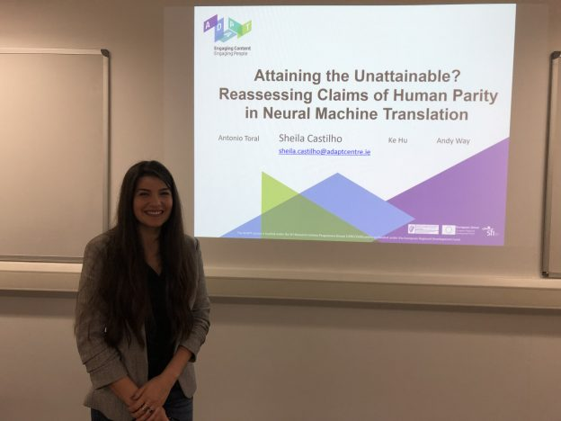

This week we have had the pleasure of welcoming Dr Sheila Castilho and Dr Natalia Resende for a one week research stay at the Research Group in Computational Linguistics. Sheila and Natalia both come from the ADAPT Centre, Dublin and have come to discuss collaborations with members of our research group. During their stay, both Natalia and Sheila gave the group a talk about their research. The details of which can be found below:

## 1. Dr Sheila Castilho's talk:

### Abstract

We reassess a recent study (Hassan et al., 2018) that claimed that machine translation (MT) has reached human parity for the translation of news from Chinese into English, using pairwise ranking and considering three variables that were not taken into account in that previous study: the language in which the source side of the test set was originally written, the translation proficiency of the evaluators, and the provision of inter-sentential context. If we consider only original source text (i.e. not translated from another language, or translationese), then we find evidence showing that human parity has not been achieved. We compare the judgments of professional translators against those of non-experts and discover that those of the experts result in higher inter-annotator agreement and better discrimination between human and machine translations. In addition, we analyse the human translations of the test set and identify important translation issues. Finally, based on these findings, we provide a set of recommendations for future human evaluations of MT.

## 2. Dr Natalia Resende's talk:

### Abstract

In Portuguese, all nouns are distributed into two gender categories: feminine and masculine. On one hand, gender can be predicted from the phonological cues present in the endings of the nouns. For example, nouns ending in -a  tend to be feminine and nouns ending in -o   tend to be masculine. On the other hand, the relationship between word ending and gender is far from being a consistent rule, since nouns ending in other phonemes may be of either gender. In the present study, a connectionist network was trained to classify Portuguese nouns into gender categories considering their phonological structure as whole. The performance of the network was analysed in detail to check whether the network considers only the endings of the nouns or their whole phonological structure for gender decisions. In addition, it was analysed what type of information the network takes into account to decide the gender of nouns whose endings are not predictive of gender. Results show an error-free performance when the network takes into account the phonological information present in the endings of the nouns and frequency effects for nonpredictive endings. The present study has implications to the training of NLP systems when classifying nouns into gender categories.

